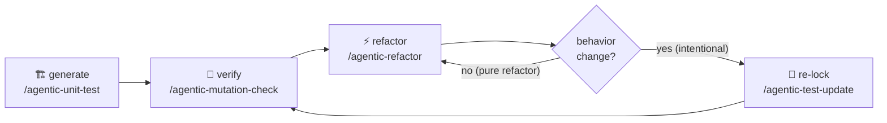

# The lock-down lifecycle

The four skills form a loop around your code's life. You can use any piece alone, but they're designed to chain:

## Stage 1 — Generate (`/agentic-unit-test.md`)

Before touching legacy code, before a big optimization pass, before a framework upgrade: lock the current behavior. Pick **per-file** granularity and **branch** coverage for the strongest net over the code you're about to change; **overall + line** for a quick, broad net.

> 💡 One file at a time (`/agentic-unit-test.md src/thing.ts branch 90 per-file`) gives faster feedback and cheaper resumes than a whole-project run.

## Stage 2 — Verify (`/agentic-mutation-check.md`)

Coverage proves execution; mutation score proves *detection*. Run `report-only` first to see where you stand — if core-logic mutants survive, let the skill strengthen the assertions. This stage is what separates "the line was run" from "changing this line breaks a test", which is the property refactoring actually needs.

Skip it for throwaway work; never skip it before a high-stakes optimization pass.

## Stage 3 — Refactor (`/agentic-refactor.md`)

Now the net earns its keep. The skill works in small steps — every step ends with the **entire** suite green and a checkpoint commit, so the worst possible outcome of any step is a clean `git checkout` back to the last good state. The frozen tests are the referee: code that fails them is reverted, not argued with.

## Stage 4 — Re-lock (`/agentic-test-update.md`)

Eventually you *want* behavior to change — a bug fix, a business-rule update. Agent tests fail, correctly. This skill shows every failure as `old locked vs new actual` and asks you, diff by diff: intended? Confirmed diffs get their tests rewritten to lock the new behavior. Anything you don't confirm stays red — an unconfirmed failure is a potential regression, and hiding it would defeat the whole system.

Then loop: back to Stage 2 to verify the re-locked net still bites.

## Utilities along the way

- `/agentic-coverage-report.md` — standings check at any point, touches nothing.
- `/agentic-test-clean.md` — full teardown; the filename convention guarantees it removes exactly and only what the suite created.
